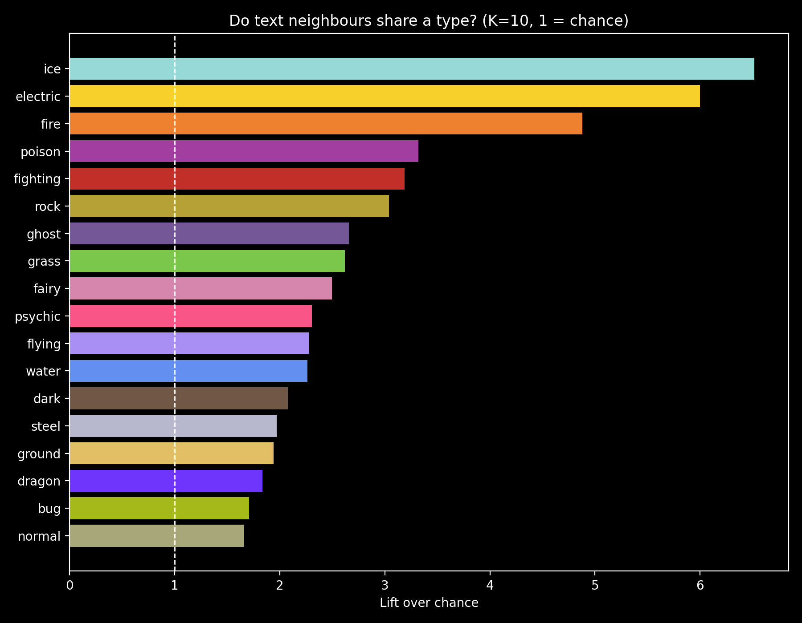

# Can a Pokedex entry reveal a Pokemon's type?



After discovering a web-game where you have to guess a Pokemon by its Pokedex entry, I realised how ambiguous some of the Pokedex entries are. That's why, after giving it some thought, I decided to test if a Pokedex entry can reveal a Pokemon's type.

Short answer: partly. Using only the text, a simple model's best guess is one of the Pokémon's real types 50.1% of the time, versus 15.7% for always guessing Water. But it depends a lot on the type: Ice, Electric and Fire entries give themselves away, while Normal, Bug and Dragon barely do.

**Interactive explorers:** [2D](link) · [3D](link)
 
## Data and method
 
- **Data:** [PokeAPI](https://pokeapi.co/). 898 Pokémon (Gens 1–8), each with its name, its one or two types, and its first English Pokédex entry.
- **Embeddings:** only the text goes into the model (`sentence-transformers`, `all-MiniLM-L6-v2`). The model never sees the name or the type.
- **Classifier:** a one-vs-rest logistic regression that answers a yes/no question for each of the 18 types, so dual types are handled properly. Evaluated with 5-fold cross-validation.
- **Baseline:** always guessing Water, the most common type (15.7%).
- **Cohesion:** a second, model-free measurement. For each Pokémon, I look at the 10 Pokémon with the most similar text and check how many share its type.

## What I found

Cohesion by type image

This chart shows how many times more often a Pokémon's text-neighbours share its type than random chance would give. Let's use an example: In total, there are 41/898 ice type pokemon up to gen8. This means that if I picked 10 random Pokemon, I would only get about 0.5 ice Pokemon (4.6% of all pokemon are ice type). 

Now, let's take an ice Pokemon and try to find how many of its neighbours (other pokemon with the closest Pokedex entry) are also ice type. Turns out, 3 of them are also ice! (30%). 30% divided by 4.6% is about 6.5. That's the **lift**. 1 means same as chance, and 6.5 means the neighbours share the type 6.5 times more often than chance.

The top of the chart is Ice (6.5), Electric (6.0) and Fire (4.9). The bottom is Normal (1.7), Bug (1.7) and Dragon (1.8). Every single type is above 1, so the text always carries some signal about the type, just very different amounts.

Classifier image

Overall, the classifier's best guess is one of the Pokémon's real types 50.1% of the time (15.7% for the baseline). Per type, Electric (F1 0.69), Fire (F1 0.66) and Ice (F1 0.62) are the easiest, while Dragon (F1 0.17) and Dark (F1 0.20) are the hardest. Two very different measurements agree on which types are easy and which are hard. The results are also similar across generations (between 38% and 56% per generation), so no single generation is carrying the result.


Type similarity image

This is another graph that makes a lot of sense when you start to look into it. It shows the similarity score between types. Obviously, a type is 100% (1) similar to himself, but the interesting part is what pairs of different types are the most mixed up. Rock and Ground, Rock and Steel, Fairy and Psychic and finally Ghost and Psychic. Honestly, these are all answers that make sense: I still get Rock and Ground mixed up to this day.


## Limitations
 
- **One text per Pokémon.** I only use the first English Pokédex entry. Entries come from different games and have different writing styles, so some of the signal (or noise) may be style rather than meaning.
- **Evolution lines.** Pokémon in the same evolution line often share both their description and their type. I did not keep evolution lines together when splitting the data, so this can make the results look better than they are. Although I guess it can also add noise since some evolutions can gain a second type.
- **The type can be stated in the text.** Some entries literally mention things like "fire" or "water". I did not mask those words.
- **Precision vs recall.** I balanced the classes so rare types would not be ignored. That raises recall (around 58% on average) but lowers precision (around 30%): the model says "yes" too easily.
- **Small classes.** Most types have only 50 to 140 examples, so differences of a few points between types or generations are mostly noise.
- **The 2D and 3D maps distort distances.** UMAP squashes 384 dimensions down to 2 or 3, so use the explorers to browse, not to measure. The numbers come from the original embeddings but as you can already probably tell they look unconclusive when observed on 2d and 3d maps.


## What I'd do next
 
- Use all the English entries of each Pokémon (and average their embeddings) instead of just one.
- Try a larger embedding model and compare.
- Compare text against numeric stats (HP, Attack, Speed...) to see if stats can also predict typing (for example HP with Normal type or Speed with Electric type). This one can be really interesting to explore.


## Run it yourself
 
```bash
pip install -r requirements.txt
python build_dataset.py   # downloads the data from PokeAPI (takes several minutes)
python report.py          # embeddings, model, figures and interactive explorers
```
 
Output goes to `data/`, `images/`, `docs/` and `results/`.
 
```
pokemon-type-from-text/
├── build_dataset.py
├── report.py
├── requirements.txt
├── data/      pokemon_all.csv, embeddings_all.npy
├── images/    figures used in this README
├── docs/      interactive explorers (GitHub Pages)
└── results/   metrics, predictions and summary
```
